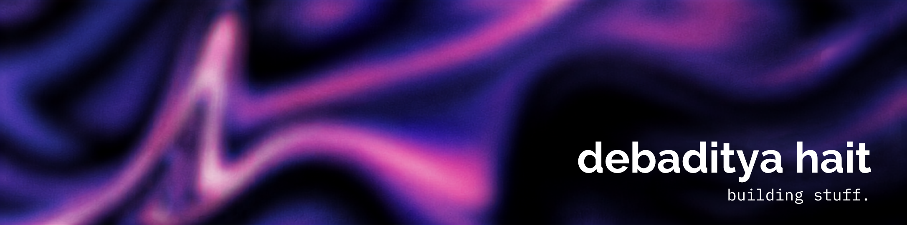

<div align="center">

<!-- Custom Banner -->


<!-- Dynamic Animated Typing Subtitle -->
<a href="https://github.com/debadityahait">
  
</a>

<br/>

<!-- Social & Verification Badges -->
<p align="center">
  <a href="https://linkedin.com/in/debadityahait" target="_blank">
    
  </a>
  <a href="mailto:debaditya2005hait@gmail.com">
    
  </a>
  <a href="https://leetcode.com/u/zazamama/" target="_blank">
    
  </a>
  <a href="https://codeforces.com/profile/zazaman" target="_blank">
    
  </a>
  <a href="https://www.codechef.com/users/debadityahait" target="_blank">
    
  </a>
  <a href="#certifications">
    
  </a>
  <a href="#certifications">
    
  </a>
</p>

</div>

---

### Overview

Computer Science Engineering student focused on **AI systems architecture, edge-native inference optimization, and distributed storage runtimes**. Active open-source contributor across major ecosystems including **Google TensorFlow, PyTorch, Rust-native pnpm, Vite, Deno, AWS Lambda, Node Redis, CERN TIGRE, and Cloudflare**.

Previous research includes internships at **Samsung R&D Institute India** (lightweight encoder-only guardrails for AI safety, ModernBERT-large 35ms inference) and **IIT Madras** (Physics-Informed Neural Networks for Alzheimer's progression modeling). Holds **9x Microsoft Certifications**, **Claude Certified Architect**, and competes in Division 1 competitive programming (**LeetCode Guardian Top 2%**, **Codeforces Expert**, **CodeChef 5-Star**).

---

<!-- Quick Stat Grid -->
<div align="center">

| Open Source PRs | Merged Upstream | Competitive Rating | Certifications | Education |
| :---: | :---: | :---: | :---: | :---: |
| **59 Pull Requests**<br/>*(47 Unique Codebases)* | **16 Merged PRs**<br/>*(TensorFlow, PyTorch, pnpm, Vite)* | [**LeetCode Guardian**](https://leetcode.com/u/zazamama/) (Top 2%)<br/>[**Codeforces Expert**](https://codeforces.com/profile/zazaman) • [**CodeChef 5★**](https://www.codechef.com/users/debadityahait) | **9x Microsoft Certified**<br/>**Claude Certified Architect** | **BTech CSE @ SRMIST**<br/>**BS Data Science @ IIT Madras** |

</div>

---

## Open Source Contributions

Summary: **59 pull requests across 47 unique repositories** (16 merged upstream, 26 active open) across **Rust, C/C++, Python, Go, and TypeScript**.

<div align="center">
  
  
  
  
</div>

<br/>

<!-- Contributed Ecosystem Star Badges Showcase -->
<p align="center">
  <a href="https://github.com/tensorflow/tensorflow"></a>
  <a href="https://github.com/pytorch/pytorch"></a>
  <a href="https://github.com/kubernetes/kubernetes"></a>
  <a href="https://github.com/vercel/next.js"></a>
  <a href="https://github.com/electron/electron"></a>
  <a href="https://github.com/denoland/deno"></a>
  <a href="https://github.com/vitejs/vite"></a>
  <a href="https://github.com/pnpm/pnpm"></a>
  <a href="https://github.com/neovim/neovim"></a>
  <a href="https://github.com/PostHog/posthog"></a>
  <a href="https://github.com/astral-sh/uv"></a>
  <a href="https://github.com/rclone/rclone"></a>
</p>

<br/>

### Merged Upstream Pull Requests

<table>
  <thead>
    <tr>
      <th width="28%">Repository</th>
      <th width="14%">Pull Request</th>
      <th width="14%">Stack / Diff</th>
      <th width="44%">Technical Solution & Impact</th>
    </tr>
  </thead>
  <tbody>
    <tr>
      <td>
        <b>Rust-Native pnpm Engine</b><br/>
        <a href="https://github.com/pnpm/pnpm"><code>pnpm/pnpm</code></a><br/>
        
      </td>
      <td>
        <a href="https://github.com/pnpm/pnpm/pull/13059"><b>#13059</b></a><br/>
        
      </td>
      <td>
        <br/>
        <code>+1,033 / -125</code>
      </td>
      <td>
        <b>Git Resolver Manifest Reader & Security Hardening:</b> Implemented a resolve-time archive fetch and manifest reader in Rust (<code>GitResolver</code>) for <code>pacquet</code>, fixing a lockfile generation panic during git-hosted dependency installs. Patched option-injection vulnerability in <code>git clone</code> (<code>--upload-pack</code>) and prevented subpath directory traversals (<code>#path:/../..</code>) across 5 crates.
      </td>
    </tr>
    <tr>
      <td>
        <b>Rust-Native pnpm Engine</b><br/>
        <a href="https://github.com/pnpm/pnpm"><code>pnpm/pnpm</code></a><br/>
        
      </td>
      <td>
        <a href="https://github.com/pnpm/pnpm/pull/13056"><b>#13056</b></a><br/>
        
      </td>
      <td>
        <br/>
        <code>+260 / -12</code>
      </td>
      <td>
        <b>Git Specifier Normalization:</b> Developed a cycle-safe Git specifier normalization module in Rust, preventing false-stale lockfile errors on equivalent protocols (<code>git+https://</code> vs <code>git://</code>) and hosted shortcuts (<code>github:</code>) during frozen installs.
      </td>
    </tr>
    <tr>
      <td>
        <b>Google TensorFlow Core</b><br/>
        <a href="https://github.com/tensorflow/tensorflow"><code>tensorflow/tensorflow</code></a><br/>
        
      </td>
      <td>
        <a href="https://github.com/tensorflow/tensorflow/pull/124961"><b>#124961</b></a><br/>
        
      </td>
      <td>
        <br/>
        <code>+28 / -9</code>
      </td>
      <td>
        <b>oneDNN Layout Rewriting Crash Fix:</b> Preserved 64-bit integer convolution attributes across oneDNN layout rewriting passes in TensorFlow's C++ kernel engine, converting fatal process aborts into clean <code>InvalidArgumentError</code> exceptions.
      </td>
    </tr>
    <tr>
      <td>
        <b>PyTorch Distributed Core</b><br/>
        <a href="https://github.com/pytorch/pytorch"><code>pytorch/pytorch</code></a><br/>
        
      </td>
      <td>
        <a href="https://github.com/pytorch/pytorch/pull/191831"><b>#191831</b></a><br/>
        <a href="https://github.com/pytorch/pytorch/commit/30731ee8f01763cf1d32dc2e3962f51fc034c482"><code>30731ee</code></a><br/>
        
      </td>
      <td>
        <br/>
        <code>+4 / -2</code>
      </td>
      <td>
        <b>Symmetric-Memory Triton Hooks:</b> Resolved Ruff B018 static analysis warnings in <code>torch.distributed._symmetric_memory</code> while preserving deliberate lazy module attribute lookup mechanics across NVSHMEM and Shared Memory Triton utilities.
      </td>
    </tr>
    <tr>
      <td>
        <b>Vite Build Engine</b><br/>
        <a href="https://github.com/vitejs/vite"><code>vitejs/vite</code></a><br/>
        
      </td>
      <td>
        <a href="https://github.com/vitejs/vite/pull/22947"><b>#22947</b></a><br/>
        
      </td>
      <td>
        <br/>
        <code>+100 / -2</code>
      </td>
      <td>
        <b>Chunk Import Map CSS Caching:</b> Fixed browser cache collisions in Vite's experimental chunk import-map engine by mapping dynamically extracted CSS assets back to parent Rollup chunks and generating stable Web Import Map specifiers.
      </td>
    </tr>
    <tr>
      <td>
        <b>PostHog CLI</b><br/>
        <a href="https://github.com/PostHog/posthog"><code>PostHog/posthog</code></a><br/>
        
      </td>
      <td>
        <a href="https://github.com/PostHog/posthog/pull/70314"><b>#70314</b></a><br/>
        
      </td>
      <td>
        <br/>
        <code>+248 / -30</code>
      </td>
      <td>
        <b>Sourcemap Upload Concurrency:</b> Replaced a hardcoded global Rayon thread pool with an isolated, configurable concurrency pool in the Rust PostHog CLI, exposing <code>--concurrency</code> controls to prevent CI/CD network and resource exhaustion.
      </td>
    </tr>
    <tr>
      <td>
        <b>Node Redis</b><br/>
        <a href="https://github.com/redis/node-redis"><code>redis/node-redis</code></a><br/>
        
      </td>
      <td>
        <a href="https://github.com/redis/node-redis/pull/3388"><b>#3388</b></a><br/>
        
      </td>
      <td>
        <br/>
        <code>+66 / -8</code>
      </td>
      <td>
        <b>Sentinel Outage Retry Bounding:</b> Enforced <code>maxCommandRediscovers</code> bounds on post-connect Sentinel topology rediscoveries during cluster outages and implemented <code>#resetInBackground()</code> for graceful promise rejections.
      </td>
    </tr>
    <tr>
      <td>
        <b>rclone Cloud Sync</b><br/>
        <a href="https://github.com/rclone/rclone"><code>rclone/rclone</code></a><br/>
        
      </td>
      <td>
        <a href="https://github.com/rclone/rclone/pull/9712"><b>#9712</b></a><br/>
        
      </td>
      <td>
        <br/>
        <code>+100 / -55</code>
      </td>
      <td>
        <b>Context-Aware SDK Calls:</b> Refactored Dropbox backend to propagate caller <code>context.Context</code> down to HTTP execution sites, eliminating leaked goroutines and ensuring prompt cancellation during interrupted transfers.
      </td>
    </tr>
    <tr>
      <td>
        <b>CERN TIGRE</b><br/>
        <a href="https://github.com/CERN/TIGRE"><code>CERN/TIGRE</code></a><br/>
        
      </td>
      <td>
        <a href="https://github.com/CERN/TIGRE/pull/762"><b>#762</b></a><br/>
        
      </td>
      <td>
         <br/>
        <code>+18 / -2</code>
      </td>
      <td>
        <b>Tomography Calibration Math:</b> Corrected Varian CBCT rotational scan direction math (CW vs CC) and uncompressed XIM pixel buffer decoding in CERN's TIGRE reconstruction toolbox, verified against Zenodo phantom datasets.
      </td>
    </tr>
    <tr>
      <td>
        <b>Deepset Haystack AI</b><br/>
        <a href="https://github.com/deepset-ai/haystack-core-integrations"><code>deepset-ai/haystack-core-integrations</code></a><br/>
        
      </td>
      <td>
        <a href="https://github.com/deepset-ai/haystack-core-integrations/pull/3543"><b>#3543</b></a><br/>
        
      </td>
      <td>
        <br/>
        <code>+141 / -3</code>
      </td>
      <td>
        <b>SentenceTransformers Quantization:</b> Resolved divide-by-zero errors in single-text int8/uint8 embeddings by introducing static pre-calibrated quantization ranges (<code>shape: (2, D)</code>).
      </td>
    </tr>
    <tr>
      <td>
        <b>IBM / DS3 Docling</b><br/>
        <a href="https://github.com/docling-project/docling"><code>docling-project/docling</code></a><br/>
        
      </td>
      <td>
        <a href="https://github.com/docling-project/docling/pull/3875"><b>#3875</b></a><br/>
        
      </td>
      <td>
        <br/>
        <code>+45 / -2</code>
      </td>
      <td>
        <b>Document Pipeline Crash Fix:</b> Added defensive page validation in <code>SimplePipeline</code> to skip image enrichment for PPTX native charts without page renders, fixing an index out-of-bounds conversion crash.
      </td>
    </tr>
    <tr>
      <td>
        <b>Neovim Core</b><br/>
        <a href="https://github.com/neovim/neovim"><code>neovim/neovim</code></a><br/>
        
      </td>
      <td>
        <a href="https://github.com/neovim/neovim/pull/41067"><b>#41067</b></a><br/>
        
      </td>
      <td>
         <br/>
        <code>+22 / -2</code>
      </td>
      <td>
        <b>UI2 Highlight Retention:</b> Engineered buffer-scoped highlight lifecycle checks in Neovim's C command-line UI subsystem to preserve substitution confirmation highlights under <code>nohlsearch</code>.
      </td>
    </tr>
    <tr>
      <td>
        <b>Twenty CRM</b><br/>
        <a href="https://github.com/twentyhq/twenty"><code>twentyhq/twenty</code></a><br/>
        
      </td>
      <td>
        <a href="https://github.com/twentyhq/twenty/pull/23945"><b>#23945</b></a><br/>
        
      </td>
      <td>
        <br/>
        <code>+80 / -2</code>
      </td>
      <td>
        <b>Relational Data Preservation:</b> Patched entity deduplication in NestJS/GraphQL backend services, preserving polymorphic relations and timeline activity records during contact merges.
      </td>
    </tr>
    <tr>
      <td>
        <b>AWS Lambda Powertools</b><br/>
        <a href="https://github.com/aws-powertools/powertools-lambda-python"><code>aws-powertools/powertools-lambda-python</code></a><br/>
        
      </td>
      <td>
        <a href="https://github.com/aws-powertools/powertools-lambda-python/pull/8374"><b>#8374</b></a><br/>
        
      </td>
      <td>
        <br/>
        <code>+50 / -5</code>
      </td>
      <td>
        <b>OpenAPI Parameter Deduplication:</b> Omitted redundant <code>Content-Type</code> header parameters from generated OpenAPI specifications while preserving runtime media-type validation.
      </td>
    </tr>
    <tr>
      <td>
        <b>Cloudflare Workers SDK</b><br/>
        <a href="https://github.com/cloudflare/workers-sdk"><code>cloudflare/workers-sdk</code></a><br/>
        
      </td>
      <td>
        <a href="https://github.com/cloudflare/workers-sdk/pull/14668"><b>#14668</b></a><br/>
        
      </td>
      <td>
        <br/>
        <code>+140 / -1</code>
      </td>
      <td>
        <b>Local Explorer UI Containment:</b> Added responsive vertical scroll containment to the worker selection UI, resolving clipping bugs for multi-worker environments.
      </td>
    </tr>
    <tr>
      <td>
        <b>Apache DataFusion Comet</b><br/>
        <a href="https://github.com/apache/datafusion-comet"><code>apache/datafusion-comet</code></a><br/>
        
      </td>
      <td>
        <a href="https://github.com/apache/datafusion-comet/pull/5458"><b>#5458</b></a><br/>
        
      </td>
      <td>
        <br/>
        <code>+11 / -0</code>
      </td>
      <td>
        <b>Performance Tuning Guide:</b> Documented columnar-to-row (C2R) transition overhead and stage-revert tuning strategies for wide and nested Spark schemas.
      </td>
    </tr>
    <tr>
      <td>
        <b>MUI Material-UI</b><br/>
        <a href="https://github.com/mui/material-ui"><code>mui/material-ui</code></a><br/>
        
      </td>
      <td>
        <a href="https://github.com/mui/material-ui/pull/48883"><b>#48883</b></a><br/>
        
      </td>
      <td>
        <br/>
        <code>+32 / -3</code>
      </td>
      <td>
        <b>Slot Prop Inheritance:</b> Documented React <code>Autocomplete</code> slot prop inheritance rules to prevent rendering bugs during multi-select custom input adornment configuration.
      </td>
    </tr>
  </tbody>
</table>

<br/>

### Selected Active Open Pull Requests

| Repository | PR Link | Stack | Technical Focus |
| :--- | :---: | :---: | :--- |
| **Apache DataFusion Ballista**<br/>[`apache/datafusion-ballista`](https://github.com/apache/datafusion-ballista)<br/> | [#2397](https://github.com/apache/datafusion-ballista/pull/2397) | `Rust` `utoipa` `+523 / -26` | OpenAPI v3 specification generator and JSON endpoint for distributed scheduler. |
| **Delta Lake Core**<br/>[`delta-io/delta-rs`](https://github.com/delta-io/delta-rs)<br/> | [#4685](https://github.com/delta-io/delta-rs/pull/4685) | `Rust` `Parquet` `+43 / -4` | Nested struct field override preservation for DataFusion Parquet leaf pruning. |
| **Hugging Face Safetensors**<br/>[`huggingface/safetensors`](https://github.com/huggingface/safetensors)<br/> | [#826](https://github.com/safetensors/safetensors/pull/826) | `Rust` `Python` `+34 / -3` | Strict memory-layout validation rejecting non-C-contiguous NumPy arrays. |
| **Kubernetes Core**<br/>[`kubernetes/kubernetes`](https://github.com/kubernetes/kubernetes)<br/> | [#140791](https://github.com/kubernetes/kubernetes/pull/140791) | `Go` `Kubelet` `+57 / -4` | Pre-allocation bypass for zero-valued device requests in Kubelet Device Manager. |
| **Deno Runtime Core**<br/>[`denoland/deno`](https://github.com/denoland/deno)<br/> | [#36532](https://github.com/denoland/deno/pull/36532) | `Rust` `JS` `+52 / -8` | Teardown socket cleanup closing accepted idle HTTP sockets in Node compatibility layer. |
| **Google TensorFlow Core**<br/>[`tensorflow/tensorflow`](https://github.com/tensorflow/tensorflow)<br/> | [#124960](https://github.com/tensorflow/tensorflow/pull/124960) | `C++` `Runtime` `+9 / -1` | Inter-op compute pool handling for negative thread configuration values. |
| **Google TensorFlow Core**<br/>[`tensorflow/tensorflow`](https://github.com/tensorflow/tensorflow)<br/> | [#124959](https://github.com/tensorflow/tensorflow/pull/124959) | `C++` `oneDNN` `+35 / -1` | Rewrite error propagation preventing aborts on invalid quantized pooling attributes. |
| **PyTorch Deep Learning**<br/>[`pytorch/pytorch`](https://github.com/pytorch/pytorch)<br/> | [#191876](https://github.com/pytorch/pytorch/pull/191876) | `Python` `torch.compile` `+65 / -3` | Input shape validation for `pixel_shuffle` meta-registrations and compile paths. |
| **Astral uv**<br/>[`astral-sh/uv`](https://github.com/astral-sh/uv)<br/> | [#20855](https://github.com/astral-sh/uv/pull/20855) | `Rust` `+115 / -27` | Staged atomic binary updates on Windows eliminating file-lock permission panics. |
| **Apple CoreMLTools**<br/>[`apple/coremltools`](https://github.com/apple/coremltools)<br/> | [#2767](https://github.com/apple/coremltools/pull/2767) | `Python` `MIL` `+46 / -5` | MIL compiler validation rejecting symbolic classifier probability shapes. |
| **Electron Core**<br/>[`electron/electron`](https://github.com/electron/electron)<br/> | [#52737](https://github.com/electron/electron/pull/52737) | `C++` `TS` `+37 / -9` | BaseWindow normalization ensuring compliance with `Partial<Rectangle>` bounds. |
| **Vercel Next.js**<br/>[`vercel/next.js`](https://github.com/vercel/next.js)<br/> | [#96111](https://github.com/vercel/next.js/pull/96111) | `TypeScript` `+40 / -1` | Middleware rewrite search parameter retention in App Router request URLs. |
| **AWS Lambda Rust Runtime**<br/>[`aws/aws-lambda-rust-runtime`](https://github.com/aws/aws-lambda-rust-runtime)<br/> | [#1162](https://github.com/aws/aws-lambda-rust-runtime/pull/1162) | `Rust` `SNS` `+45 / -2` | Fixed millisecond timestamp precision for SNS signature verification. |
| **Ansible Automation**<br/>[`ansible/ansible`](https://github.com/ansible/ansible)<br/> | [#87326](https://github.com/ansible/ansible/pull/87326) | `Python` `+224 / -4` | Direct tarball download command in `ansible-galaxy role` for air-gapped systems. |
| **Graphify Knowledge Graph**<br/>[`Graphify-Labs/graphify`](https://github.com/Graphify-Labs/graphify)<br/> | [#2728](https://github.com/Graphify-Labs/graphify/pull/2728) | `Python` `+176 / -51` | Windows CLI candidate probing preventing PATH-shadowing subprocess errors. |
| **Graphify Knowledge Graph**<br/>[`Graphify-Labs/graphify`](https://github.com/Graphify-Labs/graphify)<br/> | [#2726](https://github.com/Graphify-Labs/graphify/pull/2726) | `Python` `+85 / -17` | Fail-closed artifact preservation during community labeling failures. |
| **Storybook Ecosystem**<br/>[`storybookjs/storybook`](https://github.com/storybookjs/storybook)<br/> | [#35520](https://github.com/storybookjs/storybook/pull/35520) | `TypeScript` `+250 / -10` | Angular Signal Query isolation preventing property overwrites in decorators. |
| **Microsoft PowerToys**<br/>[`microsoft/PowerToys`](https://github.com/microsoft/PowerToys)<br/> | [#49375](https://github.com/microsoft/PowerToys/pull/49375) | `C++` `+56 / -10` | Culture-aware digit formatting for Command Palette calculator results. |
| **Pytest Framework**<br/>[`pytest-dev/pytest`](https://github.com/pytest-dev/pytest)<br/> | [#14707](https://github.com/pytest-dev/pytest/pull/14707) | `Python` `+69 / -13` | Custom TOML file root table parsing for `pytest -c` executions. |
| **Node Version Manager**<br/>[`nvm-sh/nvm`](https://github.com/nvm-sh/nvm)<br/> | [#3891](https://github.com/nvm-sh/nvm/pull/3891) | `Shell` `+45 / -0` | Shell trap restoration for Zsh `extendedglob` terminal settings. |
| **Nx Monorepo Toolkit**<br/>[`nrwl/nx`](https://github.com/nrwl/nx)<br/> | [#36347](https://github.com/nrwl/nx/pull/36347) | `TypeScript` `+409 / -452` | Compiler plugin migration to `minimizer-webpack-plugin` with `cssnano`. |
| **NousResearch Hermes Agent**<br/>[`NousResearch/hermes-agent`](https://github.com/NousResearch/hermes-agent)<br/> | [#70711](https://github.com/NousResearch/hermes-agent/pull/70711) | `Python` `+63 / -2` | Local slash command auto-completion support in terminal interface. |
| **NousResearch Hermes Agent**<br/>[`NousResearch/hermes-agent`](https://github.com/NousResearch/hermes-agent)<br/> | [#70381](https://github.com/NousResearch/hermes-agent/pull/70381) | `TypeScript` `+175 / -1` | Reactive state refresh hooks for active chat sessions in dashboard UI. |
| **Traceroot AI**<br/>[`traceroot-ai/traceroot`](https://github.com/traceroot-ai/traceroot)<br/> | [#1860](https://github.com/traceroot-ai/traceroot/pull/1860) | `TypeScript` `+28 / -12` | Ambiguous filter field glyph replacement with neutral fallback icons. |

</details>

---

## Experience & Research

### Samsung R&D Institute India
**PRISM Research Intern (AI Safety & Systems Architecture)** &nbsp;|&nbsp; *April 2025 – September 2025*
* **Encoder-Only Guardrails:** Fine-tuned `ModernBERT-large` (395M parameters) into a lightweight classifier for prompt injection and jailbreak detection across 75k+ augmented adversarial samples (*InjectGuard, BIPIA, NotInject, WildGuard-Benign, PINT*).
* **Latency & Benchmarks:** Reached **92.70% accuracy** and **0.9021 F1-score** on a 315-prompt adversarial benchmark with **35 ms inference latency** (~300x faster than generation-based alternatives), outperforming *NVIDIA NeMo Guardrails, Llama Guard 4, Prompt Guard, and DeBERTa-v3*.
* **Publication:** Co-authored *"AI Guardrails: Performance-Optimized Guardrail System for Secure LLM and Agentic AI Interactions"*, **Accepted to ICSCCC-2026**.

### Indian Institute of Technology Madras
**AI Research & Prototyping Intern (Scientific ML & PINNs)** &nbsp;|&nbsp; *June 2025 – August 2025*
* **Physics-Informed Neural Networks (PINNs):** Embedded biological differential equations directly into PyTorch loss functions for spatiotemporal modeling of Alzheimer's disease progression on longitudinal MRI data.
* **Accuracy Gains:** Implemented automatic differentiation for PDE residuals, collocation sampling, and adaptive loss weighting, delivering a **27% improvement in early neurodegeneration prediction accuracy** over conventional deep learning baselines.

---

## Featured Projects

<table>
  <tr>
    <td width="50%" valign="top">
      <h3><a href="https://github.com/DebadityaHait/stratum">Stratum</a></h3>
      <p><b>S3-Compatible Edge Distributed Object Storage</b></p>
      <p>
        
        
        
      </p>
      <ul>
        <li>Architected edge S3 object storage achieving <b>95% cost reduction</b> via multi-tier caching (Edge Cache hot reads, R2 warm cache, Telegram Bot cold storage).</li>
        <li>Sub-50ms metadata queries via Cloudflare D1 with SHA-256 and Content-MD5 integrity checks.</li>
        <li>100% compatibility with S3 CLI/SDKs via reverse-engineered S3 XML response serialization.</li>
      </ul>
    </td>
    <td width="50%" valign="top">
      <h3><a href="https://github.com/DebadityaHait/pulseflare">Pulseflare</a></h3>
      <p><b>Serverless Edge Observability & Incident Intelligence</b></p>
      <p>
        
        
        
      </p>
      <ul>
        <li>Serverless edge uptime monitoring maintaining <b>99.99% uptime</b> across distributed endpoints.</li>
        <li>Decoupled 1-min health checks from AI anomaly analysis via Cloudflare Queues for zero latency impact.</li>
        <li>Integrated Workers AI (<code>LLaMA-3.1-8B</code>) for automated root-cause summaries, reducing MTTR by <b>70%</b>.</li>
      </ul>
    </td>
  </tr>
  <tr>
    <td width="50%" valign="top">
      <h3><a href="https://github.com/DebadityaHait/ShopLense">ShopLense</a></h3>
      <p><b>Hyperlocal Quick-Commerce Price Intelligence</b></p>
      <p>
        
        
        
      </p>
      <ul>
        <li>Aggregated live inventory & pricing across Zepto, Blinkit, Instamart, and Flipkart Minutes with <b>85% discovery speedup</b>.</li>
        <li>Reverse-engineered marketplace protocols with custom Node scrapers maintaining <b>99.8% extraction accuracy</b>.</li>
        <li>Mapped 10k+ SKUs into unified groups via token similarity algorithms; scheduled 5,000+ daily alert checks.</li>
      </ul>
    </td>
    <td width="50%" valign="top">
      <h3><a href="https://github.com/DebadityaHait/WoundDoc">WoundDoc</a></h3>
      <p><b>Edge AI Clinical Diagnostics System</b></p>
      <p>
        
        
        
      </p>
      <ul>
        <li>Hybrid MiT-b3 + CNN + P-scSE segmentation achieving <b>92.33% classification accuracy</b> and <b>87.64% Dice</b>.</li>
        <li>Quantized 16-class EfficientNet-B0 to TFLite (48 MB &rarr; 12.5 MB) for low-end mobile SoCs (Snapdragon 439).</li>
        <li>Validated in 28-day clinical pilot across 2 Tamil Nadu rural clinics (4.7% area error vs calipers). <b>Submitted to MIDL 2026</b>.</li>
      </ul>
    </td>
  </tr>
  <tr>
    <td width="50%" valign="top">
      <h3><a href="https://github.com/DebadityaHait">OnyxBin</a></h3>
      <p><b>Distributed Metadata-First Cloud Storage Engine</b></p>
      <p>
        
        
        
      </p>
      <ul>
        <li>Separated Postgres metadata from binary chunks stored via Telegram MTProto API, achieving <b>81% storage cost savings</b>.</li>
        <li>Adaptive 20 MB chunking with SHA-256 integrity; handled 1,240+ operations over 6-week beta with <b>zero data loss</b>.</li>
        <li>Server-signed HMAC-SHA256 request authorization with sub-42ms metadata API responses.</li>
      </ul>
    </td>
    <td width="50%" valign="top">
      <h3><a href="https://github.com/DebadityaHait">FluencyRecap</a></h3>
      <p><b>Vernacular & Non-Native English ASR Pipeline</b></p>
      <p>
        
        
        
      </p>
      <ul>
        <li>Fine-tuned Whisper on 180+ hrs Indian English and 62 hrs Hinglish audio, yielding a <b>22% reduction in Word Error Rate</b>.</li>
        <li>91% accuracy in detecting disfluencies (fillers, backtracking) with sub-280ms CPU inference across 650+ practice sessions.</li>
        <li>Deployed to 47 non-native speakers, delivering 37% average reduction in filler words over 3 months.</li>
      </ul>
    </td>
  </tr>
</table>

---

## Competitive Programming & Hackathons

<div align="center">

| Platform / Event | Distinction | Standing |
| :--- | :--- | :--- |
| [**LeetCode**](https://leetcode.com/u/zazamama/) | **Guardian** | **Top 2% Globally** |
| [**Codeforces**](https://codeforces.com/profile/zazaman) | **Expert** | Peak *Candidate Master* |
| [**CodeChef**](https://www.codechef.com/users/debadityahait) | **5-Star Coder** | Division 1 Competitor |
| **Goldman Sachs Hackathon 2026** | **All-India Rank 42** (Quant Track) | **Top ~0.3%** of ~14,000 participants |
| **Goldman Sachs Hackathon 2026** | **All-India Rank 144** (CS Track) | **Top ~0.9%** of 15,953 participants |
| **Amazon ML Summer School 2026** | **Selected Scholar** | **Top 2.2%** (Top 3,000 of 134,000+ applicants) |
| **Flipkart GRiD 8.0 (2026)** | **National Semifinalist** (Software Dev) | **Top ~2.3%** of 130,000+ applicants |
| **Flipkart GRiD 7.0 (2025)** | **National Semifinalist** (Software Dev) | Selected among **160,000+ participants** |
| **Adobe India Hackathon 2025** | **National Semifinalist** (Creator of *Outlinr*) | Selected from **260,000 registrations** |
| **Founder’s Scholarship** | **Full Academic Merit Scholarship** | SRM Institute of Science and Technology (2023) |

</div>

---

## Certifications

<div align="center">

| Issuer | Credential Title | Verification ID |
| :--- | :--- | :--- |
|  | **Microsoft Certified: Fabric Data Engineer Associate** | `2CFE44AF9A03CA00` |
|  | **Microsoft Certified: Azure Data Scientist Associate** | `6B609B2E62C7DD1B` |
|  | **Microsoft Certified: Azure Developer Associate** | `7C24709582312829` |
|  | **Microsoft Certified: Azure AI Engineer Associate** | `C6A78B398CD5D2CE` |
|  | **Microsoft Certified: Fabric Analytics Engineer Associate** | `31C332B22EA60C45` |
|  | **Microsoft Certified: Power BI Data Analyst Associate** | `AB65FD5A69BEE6C9` |
|  | **Microsoft Certified: Azure Fundamentals** | `C98BA2EF3EA717B0` |
|  | **Microsoft Certified: Azure Data Fundamentals** | `A05553E0E826BF55` |
|  | **Microsoft Certified: Azure AI Fundamentals** | `743A61D9C9700E53` |
|  | **Claude Certified Architect - Foundations** | Anthropic Verified |
|  | **OCI Certified AI Foundations Associate** | Oracle Cloud Verified |
|  | **Machine Learning Specialization** | Stanford / DeepLearning.AI |

</div>

---

## Technical Skills

<div align="center">

```
========================================================================================================
  CORE LANGUAGES       ::  Rust  •  C / C++  •  Python  •  TypeScript  •  Go  •  SQL  •  JavaScript
  SYSTEMS & RUNTIMES   ::  Deno  •  Node.js  •  Linux Kernel APIs  •  oneDNN  •  Triton  •  Electron
  AI / ML / TENSORS    ::  PyTorch  •  TensorFlow  •  TFLite  •  Hugging Face  •  Safetensors  •  PINNs
  EDGE & CLOUDFLARE    ::  Cloudflare Workers  •  D1  •  R2  •  KV  •  Queues  •  Workers AI  •  Pages
  BACKEND & STORAGE    ::  FastAPI  •  Next.js App Router  •  PostgreSQL / Neon  •  Prisma  •  Redis  •  S3
  DEV TOOLS & DEVOPS   ::  Git  •  Docker  •  Wrangler  •  Rollup / Vite  •  pnpm  •  uv  •  Pytest  •  Vitest
========================================================================================================
```

</div>

<p align="center">
  <!-- Languages -->
  
  
  
  
  
  <!-- AI / ML -->
  
  
  
  <!-- Cloud & Edge -->
  
  
  
  
  
  
</p>

---

## Education

* **SRM Institute of Science and Technology, Kattankulathur, Tamil Nadu**  
  *BTech in Computer Science and Engineering* (2023 – Present)  
  *Focus:* Computer Architecture, Operating Systems, Data Structures & Algorithms, Distributed Systems, AI Systems Architecture.

* **Indian Institute of Technology Madras**  
  *BS in Data Science and Applications* (2024 – Present)

---

## Contact

<div align="center">

<p align="center">
  <a href="https://linkedin.com/in/debadityahait">
    
  </a>
  &nbsp;
  <a href="mailto:debaditya2005hait@gmail.com">
    
  </a>
  &nbsp;
  <a href="https://github.com/debadityahait">
    
  </a>
</p>

</div>
